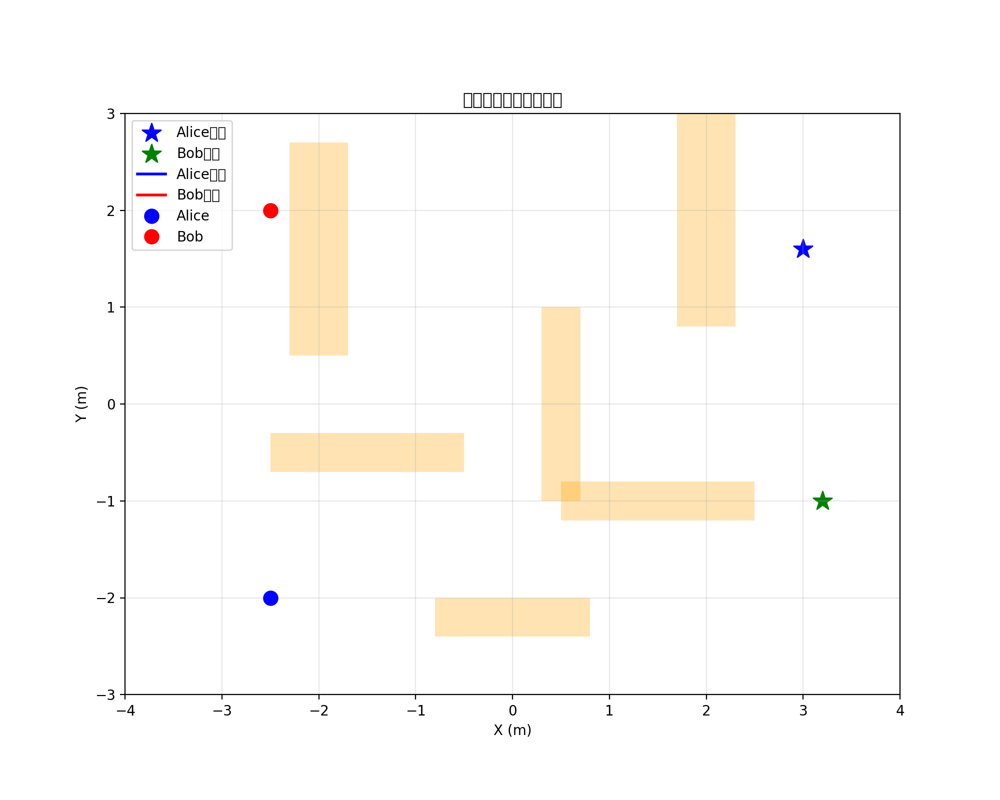
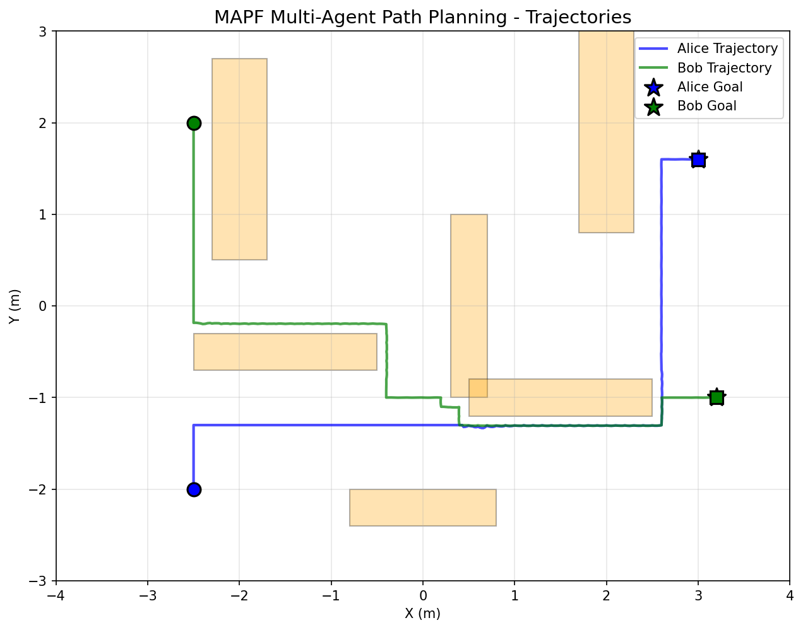
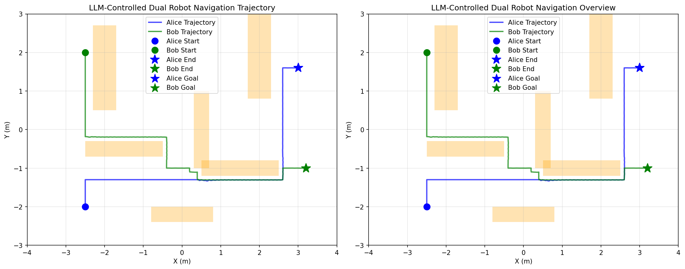
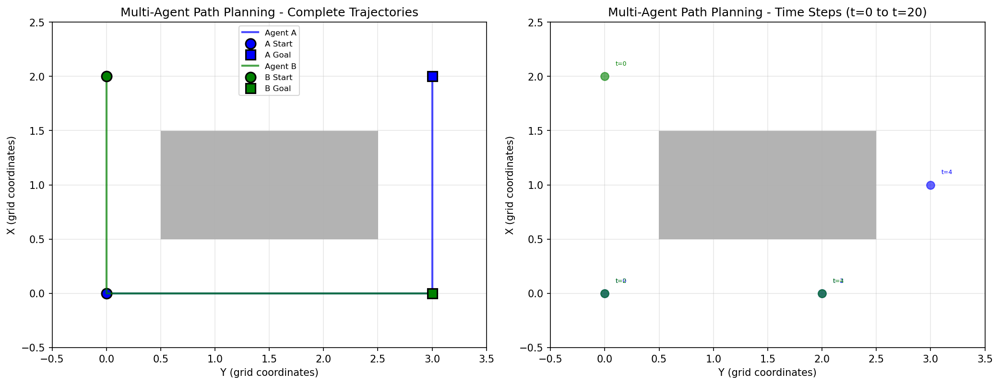
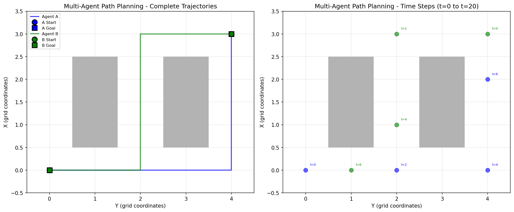

# Language-Driven Multi-Robot Path Planning

## 🎯 Enhanced Dual-Robot Navigation System

### Overview
This repository contains a dual-robot navigation system with natural language control. The system features:
- **Multi-Agent Path Finding (MAPF)**: Priority-based collision-free path planning
- **Natural Language Control**: LLM-powered command parsing for robot control
- **Real-time 3D Visualization**: MuJoCo 3D viewer with interactive controls
- **Challenging Obstacle Course**: 6 strategically placed obstacles requiring complex navigation

### Key Features

#### 1. Multi-Agent Path Finding (MAPF)
- **Priority Planning**: Higher-priority robots plan first, avoiding collisions
- **Vertex & Edge Conflict Prevention**: Prevents same-position and position-swapping conflicts
- **Time-Extended A***: Time-aware path planning with wait actions
- **Reservation Table**: Tracks occupied positions and edges across time

#### 2. Natural Language Control
- **LLM Integration**: GPT-4o powered command parsing
- **Structured Task Plans**: Pydantic models for robust validation
- **Offline Mode**: Deterministic parsing for demos without API calls
- **Example Commands**: 
  - `"Robot A go to (3, 2), Robot B go to (-2, 2), A has priority"`
  - `"Alice 先到达目标，Bob 等 2 秒再出发"` (Chinese supported)

#### 3. Visualization
- **3D MuJoCo Viewer**: Real-time interactive visualization
- **2D Matplotlib Animation**: Cross-platform trajectory visualization
- **Path Visualization**: Visual representation of planned paths

### Quick Start

#### Method 1: End-to-End Natural Language Navigation (Recommended)
```bash
./llm_interface/run_with_viewer.sh
# Or directly:
python llm_interface/end_to_end_navigation.py
```
Then type a natural language command like:
```
Robot A go to (3, 2), Robot B go to (-2, 2), A has priority
```

#### Method 2: MAPF Path Planning Demo
```bash
python nav_world/run_mapf_demo.py
```

#### Method 3: 2D Matplotlib Animation
```bash
python my_demos/robot_navigation_demo.py
```

### Project Structure
```
language-driven-LLM-path-planing/
├── llm_interface/                    # Natural language control
│   ├── end_to_end_navigation.py     # Main end-to-end controller ⭐
│   ├── llm_controller.py            # LLM parsing (Pydantic models)
│   ├── find_valid_commands.py       # Utility to find valid goals
│   └── run_with_viewer.sh          # Launch script ⭐
│
├── nav_world/                       # Core navigation system
│   ├── nav_env_mapf.py             # MAPF-integrated environment
│   ├── multi_agent_planner.py      # MAPF algorithm (Priority Planning)
│   ├── nav_env.py                  # Base navigation environment
│   ├── room.xml                    # MuJoCo 3D scene
│   ├── run_mapf_demo.py            # MAPF demo script
│   └── test_mapf.py                # MAPF test script
│
├── my_demos/                        # 2D visualization demos
│   └── robot_navigation_demo.py    # Matplotlib animation
│
├── results/                         # Generated visualization files
│
└── Documentation/
    ├── README.md                    # This file
    ├── MAPF_IMPLEMENTATION_EXPLAINED.md
    ├── END_TO_END_NAVIGATION_GUIDE.md
    └── RUN_MAPF_3D.md

⭐ = Main entry points
```

### Technical Details

#### Robot Configuration
- **Alice**: Blue robot (default start: (-3.2, 2.0))
- **Bob**: Green robot (default start: (-3.2, -2.3))
- Goals can be set via natural language commands

#### Path Planning Algorithms
- **MAPF (Priority Planning)**: Multi-agent collision-free path planning
  - Time-extended A* search
  - Reservation table for conflict prevention
  - Supports wait actions
- **A* (Fallback)**: Single-agent path planning for independent navigation

#### Environment
- **Grid Resolution**: 0.1m for precise navigation
- **Obstacle Layout**: 6 strategically placed obstacles
- **Room Size**: 8m × 6m with walls

### Requirements
- Python 3.8+
- MuJoCo 2.3.0+
- NumPy, Matplotlib, ImageIO
- macOS users need `mjpython` for 3D viewer

### Installation
```bash
# Clone the repository
git clone https://github.com/huiwenxue122/language-driven-LLM-path-planing.git
cd language-driven-LLM-path-planing

# Install dependencies
pip install -r requirements.txt

# For macOS users, install MuJoCo viewer
pip install mujoco
```

### API Key Setup (Optional, for LLM features)

To use the natural language control features, you'll need an OpenAI API key:

**Option 1: Using .env file (recommended)**
```bash
echo "OPENAI_API_KEY=your-api-key-here" > .env
```

**Option 2: Using openai_key.json**
```bash
echo '"your-api-key-here"' > openai_key.json
```

Note: The system will work in offline mode without an API key, using deterministic parsing.

---

## 🎬 Results & Demos

### Navigation Animations

#### 2D Trajectory Visualization


#### MAPF Path Planning Results


#### LLM-Controlled Navigation


### Test Cases

#### MAPF Test Case 1


#### MAPF Test Case 2


#### Trajectory Plot


> **Note**: All result files are stored in the `results/` directory. The GIF animation shows the 2D trajectory visualization, while PNG files show path planning results and test cases.

---

## 📚 Documentation

- **[HOW_TO_RUN.md](HOW_TO_RUN.md)** - Complete running guide with examples
- **[MAPF_IMPLEMENTATION_EXPLAINED.md](MAPF_IMPLEMENTATION_EXPLAINED.md)** - Detailed MAPF algorithm explanation
- **[END_TO_END_NAVIGATION_GUIDE.md](END_TO_END_NAVIGATION_GUIDE.md)** - End-to-end system guide
- **[llm_interface/VALID_COMMANDS.md](llm_interface/VALID_COMMANDS.md)** - Valid command examples

---

## 🤝 Contributing

Contributions are welcome! Please feel free to submit a Pull Request.

## 📄 License

See [LICENSE](LICENSE) file for details.